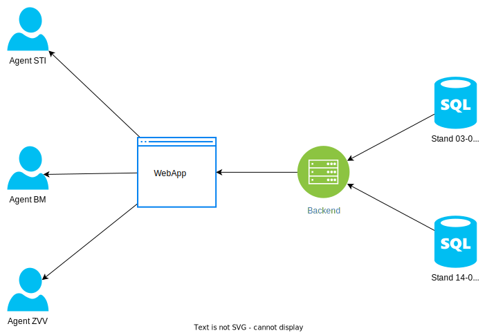
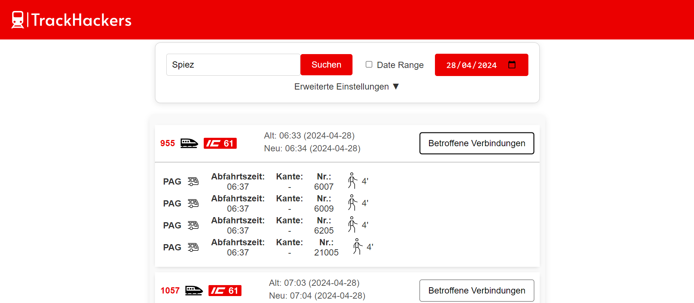
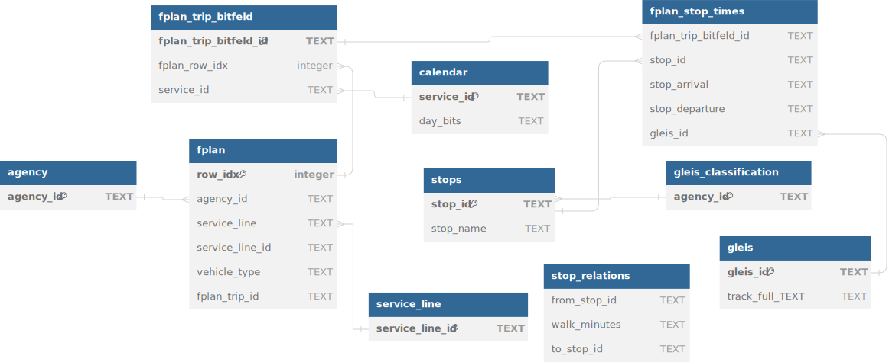

# SBB Fahrplan by TrackHackers
### SBB Fahrplan Challenge BernHäckt 2024   
by Rebeca, Benjamin, Luca

DEMO: https://test.wir-lernen-weiter.ch/

## Architektur



## Anleitung
### Deployment
Für die Benutzung des Produkts wird nur Python (z.B. 3.10) mit Flask (z.B. 3.0.0) verwendet.
```bash
cd Code/backend/src
flask run --host=0.0.0.0 --port=8000
```
Die Datenbankfiles in Code/backend/data reinladen. Allenfalls müssen die Paths noch geändert werden.
 ### Nutzung
 1. Als Transportunternehmen gewünschter Bahnhof auswählen
 2. Datumsrange auswählen
 3. Zeitrange auswählen (um z.B. nur die letzten Verbindungen am Tag zu checken)
 4. Transportunternehmen auswählen (dann werden nur die eigenen Verbindungen angezeigt)
 5. 2 Vergleichsdatensätzen Auswählen   
    --> Resultate generieren mit dem "Such" Button



## Datenmodell 
Folgende Tabellen werden verwendet



## Prozessfluss


Unsere Applikation bildet die Schnittstelle Bahnbetreiber (SBB) und dem Transportunternehmen. Durch Verspätungen (z.B. Baustellen) kommt es oft dazu, dass Anschlussbusse verpasst werden. Man könnte diese Busse jedoch um wenige Minuten verschieben und so die Anschlussprobleme verhindern. Diese Webapp vereinfacht das identifizeren dieser potentiellen Verschiebungsmöglichkeiten drastisch.

## Features
- Hier sind die wichtigsten Funktionen der App:

1. **Web-Schnittstelle:**
   - Die Anwendung verwendet Flask, um eine Webschnittstelle bereitzustellen, Vorlagen zu rendern und statische Dateien bereitzustellen
2. **Abfrage von Stations- und Agenturdaten:**
   - Routen (`/bhfs` und `/agency`) liefern JSON-Listen von Bahnhöfen und Agenturen
3. **Datenbankverwaltung:**
   - viele SQLite-Datenbanken (verwendet werden zwei: alt und neu), um Daten zu vergleichen und Änderungen im Laufe der Zeit zu erkennen
4. **Datumsabhängige Abfragen:**
   - Strecken (`/bhfs/<Datum>/<Id>`) ermöglichen die Abfrage von Zeitunterschieden und die Ermittlung von Verspätungen für bestimmte Bahnhöfe zu bestimmten Daten
5. **CSV- und Excel-Download:**
   - Ergebnisse als CSV- oder Excel-Dateien
6. **Erweiterte Suche:**
   - Erweiterte Suchoptionen, einschließlich Datumsbereich, Zeitbereich und Filterung nach Transportunternehmen
7. **Dynamische UI-Elemente:**
   - Interaktive Elemente wie Schieberegler, Dropdowns und Echtzeitvorschläge

